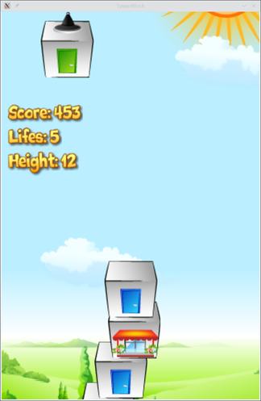

# TowerBlocks game

[](https://www.travis-ci.org/ithamsteri/towerblocks)



Gameplay video: https://youtu.be/wRYrkqACG0s

## How to build

```bash
# Clone git repositories
git clone https://github.com/ithamsteri/towerblocks
git clone https://github.com/oxygine/oxygine-framework

# Set path for oxygine framework and generate build scripts
export OXYGINE_PATH=`pwd`/oxygine-framework
cmake -H./towerblocks -BBuild

# Build game
cd Build
cmake --build .

# Start game in data directory
cd ../towerblocks/data
./../../Build/towerblock
```